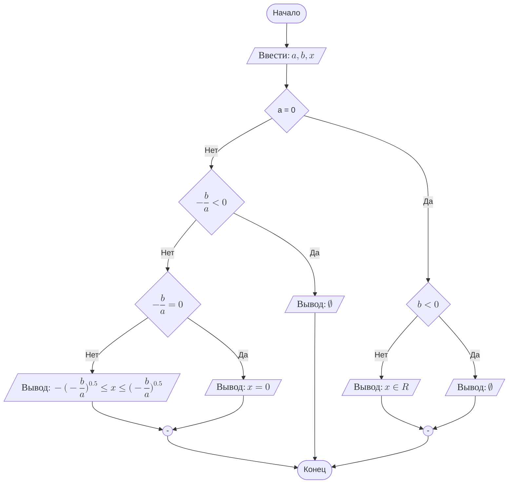

# Критерии оценивания

```mermaid
graph TD
    A([Начало]) --> B[/"$$Ввести: a, b, x$$"/]
    B --> C{a = 0}
    C -- Нет --> D{"$$- \frac{b}{a} \lt 0$$"}
    D -- Нет --> E{"$$- \frac{b}{a} = 0$$"}
    E -- Нет --> F[/"$$Вывод: -(-\frac{b}{a})^{0.5} \leq x \leq (-\frac{b}{a})^{0.5}$$"/]
    E -- Да --> G[/"$$Вывод: x = 0$$"/]
    D -- Да --> H[/"$$Вывод: \emptyset$$"/]
    C -- Да --> I{"$$b \lt 0$$"}
    I -- Нет --> J[/"$$Вывод: x \in R $$"/]
    I -- Да --> K[/"$$Вывод: \emptyset$$"/]
    J --> M(("-"))
    K --> M
    G --> L(("-"))
    H ----> Z
    F --> L
    M --> Z
    L --> Z([Конец])
    
```

