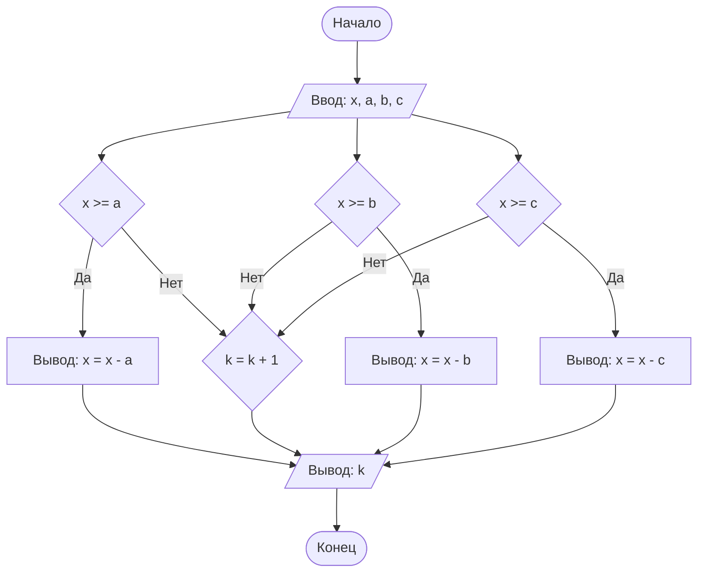

## Отчет по лабораторной работе № 1 

#### № группы: `ПМ-2403` 

#### Выполнил: `Антонова Ирина Алексеевна` 

#### Вариант: `4` 

### Cодержание: 

- [Постановка задачи](#1-постановка-задачи) 
- [Входные и выходные данные](#2-входные-и-выходные-данные) 
- [Выбор структуры данных](#3-выбор-структуры-данных) 
- [Алгоритм](#4-алгоритм) 
- [Программа](#5-программа) 
- [Анализ правильности решения](#6-анализ-правильности-решения) 

### 1. Постановка задачи 
>Трое жильцов решили выбросить в контейнер объемом X литров мусорные 
пакеты объемом A, B, C литров соответственно. Они подходят к контейнеру в указанном порядке и пытаются поместить пакет в контейнер. Если 
Пакет не помещается в контейнер, и жилец уносит свой пакет в другое место. 
Скольким жильцам не удастся выкинуть мусор в указанный контейнер? На 
вход программы подаются натуральные числа X, A, B, C. 

Задачу можно разделить на 2 подзадачи: проверка наличия свободного места в мусорном баке и подсчёт жильцов, которые не смогли выбросить мусор. 

- Для решения 1 подзадачи рассматриваем 6 вариантов: 
 1) Если X > A, тогда X -= A 
 2) Если X < A, тогда X остаётся без изменений (отрицание 1 случая) 
 3) Если X > B, тогда X -= B 
 4) Если X < B, тогда X остаётся без изменений (отрицание 3 случая) 
 5) Если X > C, тогда X -= C 
 6) Если X < C, тогда X остаётся без изменений (отрицание 5 случая) 

- Для решения 2 подзадачи вводим переменную k — счётчик не поместившегося мусора, рассматриваем 2 варианта: 
 1) Если X меньше A, B или C, то k++ 
 2) Если X > A или B или C, то k остаётся без изменений 

### 2. Входные и выходные данные 
#### Данные на вход 
На вход программа получает 4 числа, неизвестно, будут ли они целыми, т.к. объём мусора может не быть целым числом, поэтому будем считать, что числа вещественные и неотрицательные. Также нам известна только нижняя граница, т.к. объём мусора не может быть отрицательным, а верхние границы = 2^30 
| | Тип | min значение | max значение | 
|----------------------|-------------|--------------|----------------|
| X (Объем контейнера) | Вещественное число | 0 | 2<sup>30</sup> | 
| A (1 мусор) | Вещественное число | 0 | 2<sup>30</sup> | 
| B (2 мусор) | Вещественное число | 0 | 2<sup>30</sup> | 
| C (3 мусор) | Вещественное число | 0 | 2<sup>30</sup> | 

#### Данные на выход 
Поскольку программа должна вывести количество жильцов, которым не удалось выбросить мусор, нижняя граница = 0, потому что весь мусор может поместиться в контейнер, а верхняя граница = 3, потому что может случиться так, что мусор не поместится в контейнер. 
| | Тип | min значение | max значение | 
|--------------------------------------|-------------|--------------|----------------|
| k (счётчик не поместившегося мусора) | Целое число | 0 | 3 | 

### 3. Выбор структуры данных 
Программа получает на вход 4 вещественных числа, для хранения которых необходимо выделить 4 переменные (x, a, b, c) типа double. 
| | Название переменной | Тип (в Java) | 
|----------------------|---------------------|----------------|
| X (Объем контейнера) | x | double | 
| A (1 мусор) | a | double | 
| B (2 мусор) | b | double | 
| C (3 мусор) | c | double |  

Для вывода данных нам нужна переменная-счётчик (k), так как мы ведём подсчёт, то числа всегда будут целыми и неотрицательными, поэтому выделяем переменную типа int. 
| | Название переменной | Тип (в Java) | 
|--------------------------------------|---------------------|--------------|
| k (счётчик не поместившегося мусора) | k | int | 

### 4. Алгоритм 
#### Алгоритм выполнения программы: 
Алгоритм выполнения программы: 
1) Ввод данных: 
Программа считывает 4 вещественных числа, обозначенных как x, a, b, c. 
2) Ввод дополнительных переменных: 
Программе для подсчёта невыброшенного мусора необходима дополнительная переменная, принадлежащая к целым неотрицательным числам, обозначенная как k. 
3) Проверка поместиться ли мусор в контейнер: 
-> Если в контейнере x места больше или равно объему мусора a, то место, занимаемое мусором a, вычитается из контейнера x, в противном случае к счетчику k прибавляется 1, что означает, что мусор нельзя выбросить в контейнер x. 
-> С мусором b выполняется аналогичная проверка, как и с мусором a. 
-> С мусором с выполняется аналогичная проверка, как и с a. 
4) Вывод результата: 
На экран выводится счётчик k, показывающий количество мусора, который не удалось выбросить в контейнер x. 
 	
#### Блок-схема 

### 5. Программа 
```java
import java.io.PrintStream;
import java.util.Scanner;

public class Main {
    // Объявляем объект класса Scanner для ввода данных
    public static Scanner in = new Scanner(System.in);
    // Объявляем объект класса PrintStream для вывода данных
    public static PrintStream out = System.out;

    public static void main(String[] args) {
        // Считывание четырёх вещественных чисел x, a, b, c из консоли
        double x = in.nextDouble();
        double a = in.nextDouble();
        double b = in.nextDouble();
        double c = in.nextDouble();
        // Ввод переменной счётчика k
        int k = 0;

        // Определение поместиться ли мусор в контейнер
        if (x >= a) {
            // Если место в контейнере x больше или равно объему мусора a,
            // то вычитаем место, который занимает мусор a из контейнера x.
            // Иначе засчитываем, что мусор a нельзя поместить в контейнер x,
            // поэтому добавляем к счётчику k 1.
            x -= a;
        } else {
            k++;
        }
        if (x >= b) {
            // Если место в контейнере x больше или равно объему мусора b,
            // то вычитаем место, который занимает мусор b из контейнера x.
            // Иначе засчитываем, что мусор b нельзя поместить в контейнер x,
            // поэтому добавляем к счётчику k 1
            x -= b;
        } else {
            k++;
        }
        if (x >= c) {
            // Если место в контейнере x больше или равно объему мусора c,
            // то вычитаем место, который занимает мусор c из контейнера x.
            // Иначе засчитываем, что мусор c нельзя поместить в контейнер x,
            // поэтому добавляем к счётчику k 1
            x -= c;
        } else {
            k++;
        }
        // Выводим счётчик k
        out.println(k);
    }
}

```
### 6. Анализ правильности решения 
Программа работает корректно на всем множестве решений с учетом ограничений. 
1. Тест на `x = 5, a = 1,3, b = 3, c = 2`: 

 - **Input**: 
        ```
        5 1.3 3 2
        ```

 - **Output**: 
        ```
        1
        ```

2. Тест на `x = 0, a = 1,3, b = 3, c = 2 `: 

 - **Input**: 
        ```
        0 1.3 3 2 
        ```

 - **Output**: 
        ```
        3
        ```
 3. Тест на `x = 17, a = 7, b = 3,3, c = 4 `: 

 - **Input**: 
        ```
        17 7 3.3 4
        ```

 - **Output**: 
        ```
        0
        ```
4. Тест на ограничение задачи `x = 5, a = 4, b = 3, c = 2 `: 
   
 - **Input**: 
        ```
        5 4 3 2 
        ```

 - **Output**: 
        ```
        2
        ```
